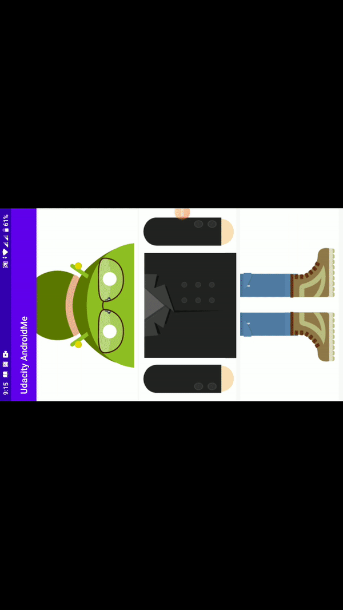

# Udacity-AndroidMe

## Components Overview

1. **Data** - Images
2. **ViewModel and LiveData** - to retain the state on config change
3. **RecyclerView**
4. **Layout manager** - GridLayoutManager
5. **Language** - Kotlin

